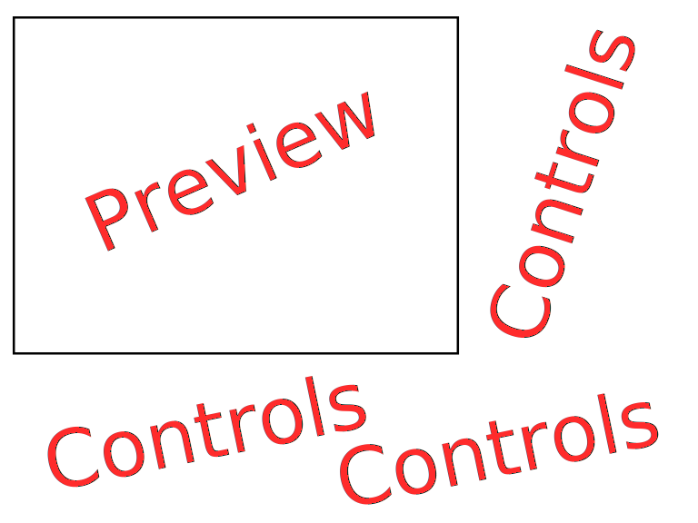

FracTool is a tool used for generating images/videos of 2D fractals using various 
algorithms.

Roadmap
-------------------------------------------------------------------------------------

### Demo 1:
- One engine
    - Single-threaded CPU
- Fractool CLI
    - All arguments
- Colormaps stored in executable
    - Multiple colormaps

### Demo 2:
- Fractool GUI

### Demo 3:
- Fractal File System
- Colormap File System

### Demo 4:
- CPU engine is now multi-threaded

### MVP:
- GPU engine using CUDA

Components
-------------------------------------------------------------------------------------

### Core

Shared components across different engines and applications

- Image/Movie Writing: Use OpenCV
- Fractal File Reading/Writing: Use YAML
- Colormap File Reading/Writing: Custom

Fractal File format: YAML file structure. Can contain one or more documents

```yaml
---
algorithm: zsquare-seed
parameters:
    c:
        real: -0.4
        imag: 0.6
transform:
    translate:
        x: 20
        y: 40
    rotate: 45
    zoom: 1.3
postprocessing:
    colormap: flower
image:
    size:
        x: 1920
        y: 1080
    filename: fractal.png
---
.
.
.
```

Colormap file data structure: A binary file representing an array of colormap objects

```c++
#define NAME_MAX_LEN 64
#define MAX_COLORS 256
#define NUM_CHANNELS 3

struct colormap {
    char name[NAME_MAX_LEN];
    unsigned char colors[MAX_COLORS][NUM_CHANNELS];
};
```

### Algorithms

The various fractal generation algorithms

- Mandelbrot
- Julia-set
    - Parameter: c complex
- Burning-Ship
- Parallel Mandelbrot
- Newton's Method
    - Parameter: roots array of complex

Each algorithm needs a way to execute on either engine... 
without having to write the algorithm twice

### Engines

- CPU: use OpenMP
- GPU: use CUDA. Default to CPU if no device available

Each engine handles:

- Fractal algorithm
- Color mapping

### Applications

#### CLI

```bash
$ fractool \
    --use-gpu | --no-use-gpu \
    --algorithm zsquare-seed \
    --parameter 'c=-0.4 + 0.6j' \
    --translate-x 20 \
    --translate-y 40 \
    --rotate 45 \
    --zoom 1.3 \
    --colormap flower \
    --image-size-x 1920 \
    --image-size-y 1080 \
    --filename 'fractal.png'
```

Or

```bash
$ fractool --load 'fractal-file.yml'
```

Parameter Groups

| Group                  | Params                                                 |
|:-----------------------|:-------------------------------------------------------|
| Algorithm              | `--algorithm`, `--parameter`                           |
| Transform              | `--translate-x`, `--translate-y`, `--rotate`, `--zoom` |
| Postprocessing         | `--colormap`                                           |
| Image                  | `--image-size-x`, `--image-size-y`, `--filename`       |
| Hardware Acceleeration | `--use-gpu`, `--no-use-gpu`                            |

#### GUI



Should use a generic software or can be a multi-platform system

- Real time display of fractal view
- Select between different algorithms
- Set parameters for algorithm
- Dynamically transform fractal using view
- Select colormap
- Set image dimensions and filename
- Save image
- Save parameters

#### Colormap Utility

Can use the same GUI but be used to create and save colormaps

Or can be written in python